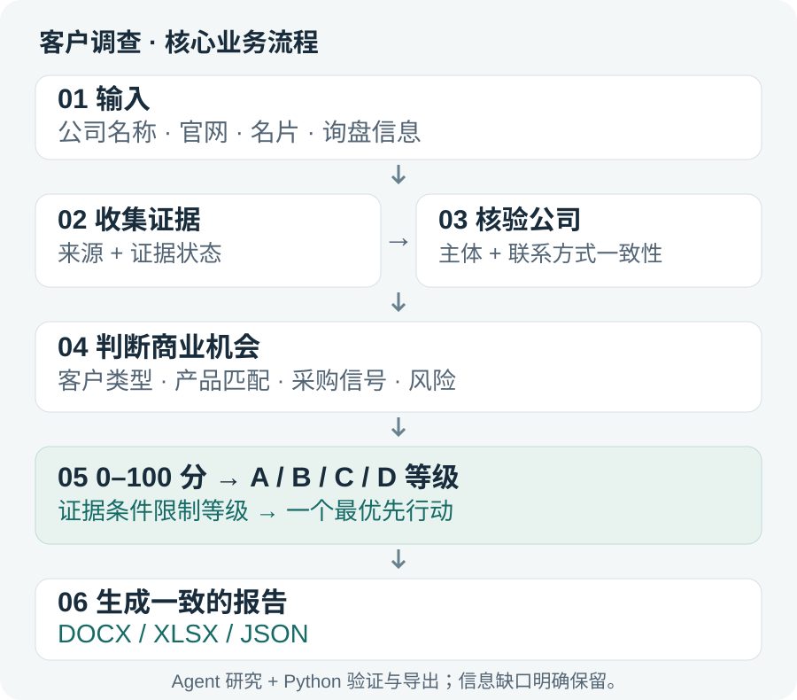
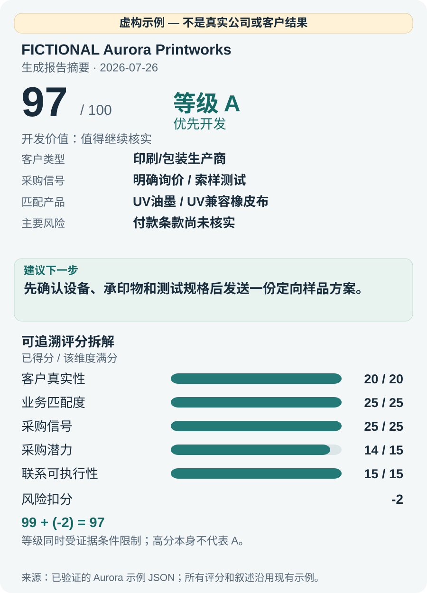

# 客户背景调查 Agent Skill

[](https://github.com/hql7-luo/foreign-customer-investigation-skill/actions/workflows/validation.yml)

[English README](README.md)

**一个基于证据的 B2B 客户调查 Agent Skill：从公司线索，得到客户等级、一个最优先行动，以及一致的 Word / Excel / JSON 报告。**

**业务价值**：让客户核验、产品匹配与开发优先级判断可以重复执行，同时保留信息缺口和交易风险。

**我构建了**：调查规则、可追溯评分模型、等级限制、确定性批量排名和报告验证导出。**能力**：Python · Pydantic · 业务逻辑 · 证据分析 · 工作流设计 · 文档自动化。

## 从输入到行动



研究步骤遵循[实际 Skill 流程](.agents/skills/foreign-customer-investigation/SKILL.md)，Python 负责验证与导出。项目是可复用 Agent Skill，包含报告生成器；不是独立网页应用。

## 一个完整的示例结果



**完全虚构的测试示例，不是真实客户成果。** 结果卡直接使用原有 Aurora 示例：**20 + 25 + 25 + 14 + 15 − 2 = 97**。产品仍需确认参数；高分不能绕过等级限制。

查看原始 [JSON](examples/chinese-user-overseas-customer/FICTIONAL_Aurora_Printworks_investigation.json)、[Word 报告](examples/chinese-user-overseas-customer/FICTIONAL_Aurora_Printworks_客户背景调查报告.docx)或 [Excel 工作簿](examples/chinese-user-overseas-customer/FICTIONAL_Aurora_Printworks_客户背景调查数据.xlsx)。英文叙述来自同一套现有示例生成器。[视觉来源与重新生成](docs/visuals/SOURCES.md)。

<details>
<summary>完整功能、安装、评分规则与使用参考</summary>

## 适用范围与边界

`foreign-customer-investigation` 是一个可复用的 Agent Skill，用于基于公开证据开展 B2B 客户背景调查、印刷行业产品匹配、采购潜力评分和开发优先级排序。

虽然名称保留 `foreign-customer-investigation`，但它同时适用于：

- 中国供应商调查海外客户
- 海外供应商调查中国客户
- 中国企业调查中国客户
- 海外企业调查其他国家客户
- 生产商、经销商、设备商、印刷厂、包装厂和终端用户之间的商业调查

结论根据被调查客户和交易证据判断，不根据调查者国籍做默认假设。

> 本工具用于辅助商业研究，不能替代正式法律意见、信用审查、专业制裁筛查或企业内部要求的客户核验。

## 核心功能

- 核验公司主体、官网、联系人、电话、邮箱、地址和信息一致性
- 判断客户类型、主营业务、商业模式、印刷工艺、设备线索和应用场景
- 根据客户证据推荐 1—3 类印刷耗材或设备维护产品
- 识别询价、索样、测试、报价、数量、时间、现有供应商问题、回复和下一步信号
- 检查公开主体、付款、物流、制裁、出口管制和交易路径风险
- 按评分明细计算 `0..100` 分
- 输出唯一的 `A`、`B`、`C` 或 `D` 开发等级
- 输出唯一的最优先行动
- 从一个 Pydantic 数据对象生成一致的 DOCX、XLSX 和 UTF-8 JSON
- 支持单客户和无并列批量排名
- 支持中文、英文、用户明确要求的中英双语和非拉丁字符
- 信息不足时强制启用简化模式
- 自动验证等级限制、输出一致性、占位符、来源数量、排名和 Unicode

## 触发条件

典型触发请求：

```text
调查这个国外客户
帮我查一下这个客户背景
判断这个客户值不值得开发
根据名片调查客户
分析客户采购潜力
给客户做背景调查报告
给这些客户排开发优先级
调查该客户适合推荐什么印刷耗材

Investigate this customer
Conduct customer due diligence
Assess this buyer's purchase potential
Generate a customer background report
```

以下请求不应自动触发完整调查：

- 只翻译客户邮件
- 只写开发信
- 只查询一个官网
- 只解释公司名称
- 没有调查需求的普通产品推荐

## 我司产品范围

- 印刷耗材
- 胶印油墨
- UV 油墨
- LED UV 产品
- 印版
- 橡皮布
- 润版液
- 清洗剂
- 印刷设备配件
- 冷却系统及相关配件
- 其他印刷、包装和设备维护相关产品

推荐必须遵循：

```text
客户已核实的产品或设备
→ 对应印刷工艺
→ 消耗品或维护需求
→ 推荐 1—3 类具体产品
```

默认不会无差别列出全部产品。

## 安装

要求：

- Python 3.11+
- `python-docx`
- `openpyxl`
- `pydantic`
- `pytest`

```bash
git clone https://github.com/hql7-luo/foreign-customer-investigation-skill.git
cd foreign-customer-investigation-skill
python3 -m venv .venv
source .venv/bin/activate
python -m pip install --require-hashes -r requirements-lock.txt
```

Windows PowerShell：

```powershell
py -3.11 -m venv .venv
.\.venv\Scripts\Activate.ps1
python -m pip install --require-hashes -r requirements-lock.txt
```

CI 验证 Python 3.11 和 3.12。`requirements-lock.txt` 使用哈希锁定已测试的依赖快照，`requirements.txt` 保留支持的版本范围。计算字段序列化需要 Pydantic 2.12+。

Skill 已放在：

```text
.agents/skills/foreign-customer-investigation/
```

可直接在本仓库使用，或复制到所用 Agent 环境支持的 Skill 搜索目录。

## 目录结构

```text
foreign-customer-investigation-skill/
├── .agents/
│   └── skills/
│       └── foreign-customer-investigation/
│           ├── SKILL.md
│           ├── agents/openai.yaml
│           ├── references/
│           │   ├── investigation-rules.md
│           │   ├── scoring-rules.md
│           │   ├── evidence-rules.md
│           │   ├── source-reliability.md
│           │   ├── report-structure.md
│           │   ├── simplified-mode.md
│           │   ├── country-adaptation.md
│           │   └── product-matching-guide.md
│           ├── templates/
│           │   ├── customer-input-template-zh.md
│           │   ├── customer-input-template-en.md
│           │   ├── report-template-zh.docx
│           │   ├── report-template-en.docx
│           │   └── investigation-template.xlsx
│           └── scripts/
│               ├── models.py
│               ├── generate_docx.py
│               ├── generate_xlsx.py
│               ├── generate_json.py
│               ├── validate_report.py
│               └── file_utils.py
├── examples/
│   ├── chinese-user-overseas-customer/
│   ├── international-user-chinese-customer/
│   ├── batch-investigation/
│   └── build_examples.py
├── tests/
├── requirements.txt
├── README.md
├── README.zh-CN.md
├── LICENSE
└── .gitignore
```

详细规则全部拆入 `references/`；`SKILL.md` 仅保留触发边界、标准工作流、核心反编造规则、输出要求和 references 路由。

## 客户输入

字段允许缺失，但影响决策的缺失字段会被记录为证据缺口。

### 中文输入示例

```text
公司名：FICTIONAL Aurora Printworks Sp. z o.o.
品牌名：FICTIONAL Aurora
联系人：Maya Example
职位：Purchasing Manager
电话：+999 000 000 001
邮箱：maya.example@aurora-print.example
官网：https://aurora-print.example
地址：1 Fictional Avenue, Example City, Poland
国家/地区：Poland
手写备注：FICTIONAL EXAMPLE — NOT A REAL COMPANY
客户提出的需求：询问UV油墨与橡皮布，并要求测试样品
沟通记录：已回复并确认下一步测试参数
其他线索：纸盒UV胶印
```

中文输入默认生成中文报告。

### 英文输入示例

```text
Company legal name: 虚构远景包装技术有限公司
Trading name / Brand: FICTIONAL Horizon
Contact: Alex Example
Job title: Operations Manager
Phone: +999 000 000 002
Email: alex.example@fictional-horizon.example
Website: https://fictional-horizon.example
Address: 中国示例省虚构市示例路2号（虚构地址）
Country / Region: China
Notes: FICTIONAL EXAMPLE — NOT A REAL COMPANY
Customer requirements: Requested only a general product catalog
Communication history: Replies continue; no quotation or sample request
Other clues: Paper-carton production
```

英文输入默认生成英文报告。需要中英双语时应明确指定。

公司名、地址等保留原始语言，同时可保存转写和翻译。电话的 `+` 国家区号不会被删除。

## 使用方式

### Agent 触发

```text
Use $foreign-customer-investigation to investigate this customer.
Generate Chinese Word, Excel, and JSON outputs.
```

```text
使用 $foreign-customer-investigation 调查这个客户，
生成中文 Word、Excel 和 JSON，并判断是否值得开发。
```

Agent 应使用公开且无需登录的来源完成调查，填充一个统一的 `InvestigationReport`，再运行三个生成器。

### 从已验证 JSON 生成输出

```bash
SKILL=.agents/skills/foreign-customer-investigation
python "$SKILL/scripts/generate_json.py" investigation.json --output-dir outputs
python "$SKILL/scripts/generate_docx.py" investigation.json --output-dir outputs
python "$SKILL/scripts/generate_xlsx.py" investigation.json --output-dir outputs
```

### 验证三种输出一致性

```bash
python "$SKILL/scripts/validate_report.py" investigation.json \
  --docx outputs/Company_Name_客户背景调查报告.docx \
  --xlsx outputs/Company_Name_客户背景调查数据.xlsx \
  --generated-json outputs/Company_Name_investigation.json
```

### 重新生成虚构示例

```bash
python examples/build_examples.py
```

所有示例均显著标注：

```text
FICTIONAL EXAMPLE — NOT A REAL COMPANY
```

示例没有使用真实公司的联系人、邮箱、电话、地址、沟通、报价或客户记录。

## 单客户调查示例

- `examples/chinese-user-overseas-customer/`
- `examples/international-user-chinese-customer/`

每个目录中的 Word、Excel 和 JSON 使用完全一致的结论。

## 多客户批量调查

每个客户生成一个模型对象，然后调用：

```python
from models import rank_reports

ranking = rank_reports(reports)
```

排序顺序：

1. 采购信号
2. 产品和应用匹配度
3. 联系人可执行性和回复
4. 重复或批量采购潜力
5. 信息完整度
6. 风险
7. 最终得分

最后使用公司名/输入顺序做确定性打破并列，确保排名编号唯一。示例见 `examples/batch-investigation/`。

## 中国客户调查

调查中国客户时应保留中文法定名称，并根据实际情况核验国家企业信用信息公示系统和统一社会信用代码等中国适用信息。不能套用 VAT、EIN、INN 或 OGRN。

`examples/international-user-chinese-customer/` 展示了海外用户调查中国包装企业的英文虚构案例。

## 海外客户调查

根据客户国家选择工商、税务编号、搜索语言、地图、社交/B2B 平台、制裁来源、地址和电话格式、货币和时区。

`examples/chinese-user-overseas-customer/` 展示了中国用户调查波兰客户的中文虚构案例。

官方系统可能限制地区访问、要求验证码或只提供特定数据。Skill 会说明限制，不会绕过限制，也不会把商业目录冒充官方确认。

## Word 输出

普通模式：

1. 结论
2. 九项背景调查总表
3. 业务员行动卡
4. 3—5 个核心网址

简化模式：

1. 结论
2. 开发价值
3. 已确认信息
4. 直接核实问题
5. 核心网址

排版采用居中标题、调查日期、深蓝色标题、浅蓝色表头和简洁商务表格，原则上控制在两页内。支持中文、英文和用户明确要求的中英双语。

## Excel 输出

六个工作表：

1. 客户概览
2. 九项调查
3. 评分明细
4. 证据与来源
5. 跟进问题
6. 开发排名

工作簿包含可见的合计公式、风险扣分、总分校验、等级公式、等级校验、筛选、冻结表头、自动换行、合理列宽和等级条件格式，不使用宏。

## JSON 输出

- 字段名固定为英文
- 内容使用 UTF-8
- 日期和国家尽量使用 ISO 规范
- 枚举使用稳定的英文机器值
- 客户名、日期、分数、等级、推荐产品、最大风险和最优先行动与 Word/Excel 一致

## 证据状态

| 状态 | 含义 |
|---|---|
| 已确认 | 官方来源、交叉验证或至少两个独立可靠来源 |
| 部分确认 | 单一官网、聚合站、客户/名片/展会线索或较旧信息 |
| 推测 | 基于工艺、耗材、维护、旺季或商业模式，且必须说明依据 |
| 信息冲突 | 重要来源存在差异，保留所有相关版本 |
| 未找到 | 未找到可靠公开证据，不等于不存在 |

## 来源优先级

1. 政府、工商、税务、法院、制裁和监管官方来源
2. 公司官网和官方渠道
3. 展会、招聘、地图和行业协会
4. 行业媒体、经销商和 B2B 平台
5. 工商聚合网站
6. 商业目录、论坛或个人帖子

低可信来源不能单独证明工商主体、营收、供应商、客户、合作品牌、进口、海关或采购记录。

## 评分规则

| 维度 | 满分 |
|---|---:|
| 客户真实性 | 20 |
| 业务匹配度 | 25 |
| 采购信号 | 25 |
| 采购潜力 | 15 |
| 联系可执行性 | 15 |
| 风险扣分 | 0 至 -20 |

最终分数限制在 `0..100`。每个维度均由可审计的明细组成。

## A/B/C/D 等级

| 等级 | 通常分数 | 含义 |
|---|---:|---|
| A | 80—100 | 主体真实、高度匹配、有明确采购信号、无明显重大风险 |
| B | 60—79 | 值得主动开发，但关键采购信息未明确 |
| C | 40—59 | 低成本跟进，采购信号弱或公开信息不足 |
| D | 低于40或存在已确认严重风险 | 暂缓开发 |

强制限制：

- 无明确采购信号，最高 B
- 无官网且主体无法确认，最高 C
- 主体真实性存疑，不得 A
- 公司规模或联系人职位不能单独支持 A
- 简化模式原则上 C 或 D
- 只能使用 A/B/C/D，不允许加减号

## 简化模式

出现任一情况时启用：

- 九项中五项以上缺少可靠信息
- 完全没有官网
- 工商主体无法确认
- 名称、邮箱、电话和地址无法交叉验证
- 公司名称过于通用
- 只有个人邮箱或社交账号
- 无法完成正常评分

开发价值只能选择：

- 值得继续核实
- 低成本观察
- 暂不建议投入

## 反编造原则

不得编造：

- 营收
- 员工人数
- 产能
- 客户或供应商
- 合作品牌
- 进口或海关数据
- 设备型号
- 采购数量或周期

查不到时写“未找到可靠公开信息”“未找到公开可靠记录”或“无法确认”。不得把“未找到”写成“不存在”。

## 隐私与数据合规

- 只使用公开、合法且无需登录的来源
- 不突破验证码、付费墙、访问控制或隐私保护
- 不使用泄露或非公开数据
- 不得提交真实客户姓名、个人邮箱、电话、地址、沟通、报价、登录凭证、Cookie、浏览器数据或 API 密钥
- 制裁与出口管制应使用当前官方来源进行准确主体匹配
- 不得仅根据国家判断客户受到制裁

`.gitignore` 已排除常见密钥和私有客户目录，但每次公开推送前仍应扫描仓库。

## 已知限制

- 公开信息可能不完整、过时、冲突、限制地区访问或无法访问
- 无法自动访问所有国家工商系统
- 不访问付费海关数据库
- 无法保证网络身份和联系人绝对真实
- 不保证调查结果绝对准确
- 不能替代法律、信用、制裁、出口管制、税务或合规审查
- Word/Excel 显示可能受字体和办公软件版本影响

## 测试

```bash
pytest -q
```

调查文本在 Excel 中始终作为文本保存；只有生成器内置的评分与等级校验使用公式。隐私检查覆盖待发布文件，并排除已忽略的本地虚拟环境与报告输出。

测试覆盖 A/B/C/D、简化模式、等级限制、评分上下限、风险扣分、Word/Excel/JSON 生成、Excel 公式、三种输出一致性、批量无并列排名、推荐数量限制、中文/英文/混合输入、中国/海外客户和非拉丁字符。

## License

[MIT License](LICENSE)

</details>
